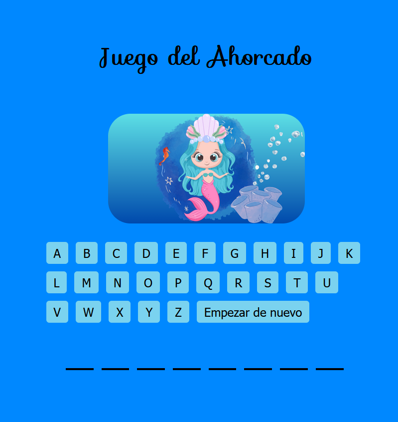

# Hangman Game

Bienvenido al juego del ahorcado. Este es un proyecto creado en PHP que implementa el clásico juego del ahorcado con una pequeña variación gráfica. Puedes jugar a adivinar la palabra antes de la sirena quede triste al ir perdiendo sus accesorios y paisaje.

## [Presentación del proyecto](https://n9.cl/hangmangame)

## Requisitos

Asegúrate de tener un servidor local como XAMPP (Windows/Linux) o MAMP (macOS) instalado.

## Cómo jugar

1. Clona o descarga este repositorio en la carpeta `htdocs` ubicado dentro de tu servidor local.
2. Lanza el servidor.
3. Abre `index.php` en el Localhost de tu navegador preferido.
4. Intenta adivinar la palabra dando click a las letras que crees que lleva.
5. Diviértete.

## Estructura del Proyecto

- `index.php`: Contiene la lógica del juego y la interfaz HTML.
- `functions.php`: Contiene funciones específicas del juego.
- `config.php`: Configuración del juego y palabras para adivinar.
- `styles.css`: Estilos CSS básicos para mejorar la apariencia.
- `carpeta images`: Imagenes de las secciones del juego.
- 
## Tecnologías Utilizadas

- PHP
- HTML
- CSS

## Licencia

Este proyecto está bajo la Licencia MIT - consulta el archivo [LICENSE](LICENSE) para más detalles.

## Hecho con muchos trasnochos por:

[Johana Sandoval](https://github.com/Sandovaljohana/) 💜
